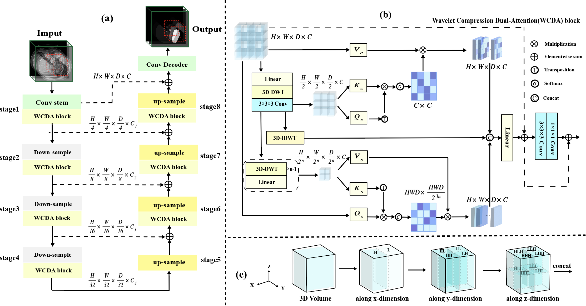

# WaveU3S

## Introduction

 

  **This repo is code of WaveU3S: A Lightweight Wavelet Dual-attention Unet For 3D Medical Image Segmentation (ISBI2024).**

WaveU3S is a segmentation network for 3D medical image. Its purpose is to reducing the computation burden while maintaining the performance under 3D segmentation tasks. We use nnUNet as default data preprocessing method and training framework. Comparative experiments are conducted on Flare22 and ACDC datasets.  For more details, please refer to our paper.

## Start
Our models are built based on [nnUNet V2](https://github.com/MIC-DKFZ/nnUNet )
### Clone repository
```shell
git clone git@github.com:kingofengineer/WaveU3S.git
cd WaveU3S/
pip install -e .
```


### Requirement
Install requirements.
```
pip install -r requirements.txt 
```


### Dataset and data pre-processing
You can obtain the datasets via following links：
* Abdominal multi organ dataset: [Flare22](https://flare22.grand-challenge.org/Dataset/) 
* Multi-category cardiac MRI dataset: [ACDC](https://humanheart-project.creatis.insa-lyon.fr/database/#collection/637218c173e9f0047faa00fb) 


The pseudo-labels for the 2,000 examples we are using were generated through inference using [Hang et al.'s model](https://github.com/Ziyan-Huang/FLARE22).

Please refer to nnUNetv2 for [data format](https://github.com/MIC-DKFZ/nnUNet/blob/master/documentation/dataset_format.md) .

Experiment planning and data preprocessing is to use:
```
nnUNetv2_plan_and_preprocess -d DATASET_ID --verify_dataset_integrity
```
You should modify the patch size of the configuration file ```nnUNetPlans.json ``` by using ```modify_Plans.py``` .


### Training
Training command:
```
nnUNetv2_train -d DATASET_ID 3d_fullres -f flod WaveU3S	
```
### Inference
Inference command:
```
nnUNetv2_predict -i input_dir -o output_dir -d DATASET_ID -c 3d_fullres --save_probabilities -f flod -m WaveU3S
```


## Citation
- If you find this work is helpful, please cite our paper
```
@inproceedings{ISBI2024,
    title={WaveU3S: A Lightweight Wavelet Dual-attention Unet For 3D Medical Image Segmentation},
    author={Tianzhao Zhong, Huaishui Yang, Jihao Li, Mengye Lyu, Shaojun Liu},
    booktitle={IEEE International Symposium on Biomedical Imaging},
